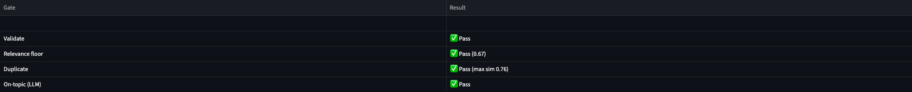
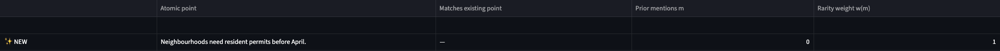
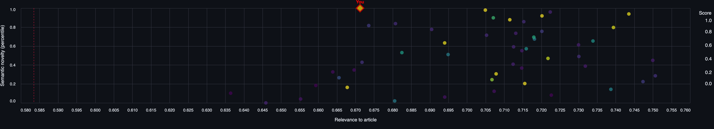
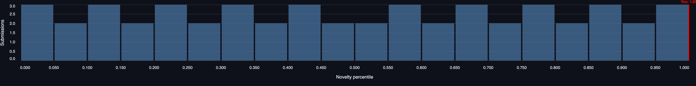
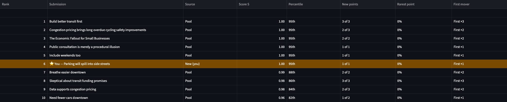

# Novelty Scorer: Rewarding Novel User Submissions

G2 AI Hiring Hackathon, **Problem Statement 3: Rewarding novelty in submissions.**

Readers respond to a short news article with a three-field form (headline, body, stance).
The pipeline scores each new submission from **0.0 to 1.0**, rewarding **ideas that no
earlier reader has raised**. Off-topic submissions score **exactly 0**, however original
they are. So do copies, gibberish and bare "great idea!" comments.

## How it works

```
validate ─► relevance floor ─► duplicate gate ─► extract atomic points ─► judge ─► score ─► add to pool
                                                  (+ "is this about the     (which earlier
                                                     article?" yes/no)       points repeat?)
```

1. **Gates** (cheap, embeddings). A malformed submission, one below the relevance floor, or
   a near-copy of a pooled submission scores 0.
2. **Atomic points** (LLM). The submission is split into its distinct arguments. The same
   call decides whether it is about the article; off-topic submissions score 0.
3. **Judge** (LLM). For each point, which earlier points make the same claim.
4. **Rarity** (code). A point made by *m* earlier submissions is worth `exp(−m/λ)`. The
   first mover gets 1.0. Points that only restate the article are neutral.
5. **Score:** `S = gates × quality × (0.85·N_point + 0.15·N_sem)`. Every factor is in [0, 1],
   so S is too. The scored submission joins the pool, so the next person to make the same
   point scores lower.

**Topic.** Problem Statement 3 leaves the content open (its example is "commentary on a news
article"). We use a **fictional** 89-word local news story, *Harborview approves downtown
congestion charge*, with 50 synthetic reader comments. Why this topic:
[DESIGN.md §1](docs/DESIGN.md#choice-of-topic).

**Stances.** Each submission has a headline, a body and a **stance**, the reader's position
on the charge:

| Stance | Meaning |
|--------|---------|
| `support` | in favour of the charge as proposed |
| `support_with_changes` | in favour of the idea, but it needs changes |
| `oppose` | against the charge |
| `undecided` | not sure yet, or asking a question |

Stance is **context for the judge only; it does not change the score.** The same idea scores
the same whichever side the reader takes, and flipping only the stance of a copied comment
still scores 0 (duplicate gate). Stage-by-stage detail: [DESIGN.md §1](docs/DESIGN.md#stances).

Details and every deviation from the original spec: [docs/DESIGN.md](docs/DESIGN.md).
Results: [docs/EVALUATION.md](docs/EVALUATION.md).

## Quick start

```bash
python3 -m venv myvenv && source myvenv/bin/activate
pip install -r requirements.txt
cp .env.example .env   # then fill in GEMINI_API_KEY and GROQ_API_KEY

# score a submission against the checked-in pool of 50
python main.py score --stance support_with_changes \
  --headline "Parking will spill into side streets" \
  --body "Drivers will park on residential streets just outside the zone and walk in, so those neighbourhoods need resident permits before April."
```

The output shows the score, the gate results, and each extracted point marked `NEW`,
`m=<prior mentions>` or `article`, with the earlier point it matched:

```
SCORE  1.000   (scored)
reason Both points are new and do not duplicate any existing points.
relevance 0.671 (body 0.678) | closest pooled 0.763 | N_sem 1.00
N_point 1.00 | quality 3/4 -> Q 1.00 | neighbours 0
  [    NEW] Drivers will park on residential streets outside the charge zone.
  [    NEW] Neighbourhoods need resident permits before April.
```

`python main.py` (no arguments) lists every command: `score`, `evaluate`, `build-pool`,
`generate` and `lambda-sweep`.

## Web UI

```bash
streamlit run app.py        # opens http://localhost:8501
```

- **Score a submission:** shows the article, a form, and the score with its breakdown:
  gates, `N_sem`, `N_point`, quality, and each extracted point marked ✨ NEW / 🔁 m=… /
  📰 article.
  - **Example buttons** (novel idea, common take, generic praise, off-topic, prompt
    injection): hover a button, or load it, to see what it demonstrates and its expected
    score.
  - **Stances:** each option shows its meaning underneath; the ⓘ icon explains that stance
    does not change the score.
- **Session pool:** scored submissions join *your session's* copy of the pool. Submit an
  idea, then a paraphrase of it, and the second one scores low. The pool on disk is never
  modified; "Reset session pool" starts over.
- **Pool** tab: every canonical point and how many submissions made it. **Evaluation** tab:
  the success criteria for the dev and holdout sets.

### Visualizations

The **Visualizations** tab and the score breakdown implement the five views from
[docs/VISUALIZATIONS.md](docs/VISUALIZATIONS.md). Every number
comes from the real pipeline — `data/corpus_scores.json` for the checked-in pool, live
`ScoreResult`s for anything scored in the session — never illustrative placeholders.

**Gates + score components.** Pass/fail for validate, relevance floor, duplicate and
on-topic, then a bar chart showing how much `α·N_point` and `(1-α)·N_sem` each contributed
before the quality factor is applied.



**Point-level LLM view.** For each atomic point extracted from the submission: whether the
judge matched it to an earlier point, how many prior submissions made it (`m`), and the
resulting rarity weight `w(m) = exp(-m/λ)`. A first-mover point (`m = 0`) gets the full bar;
a heavily-repeated point shrinks toward zero.



**Relevance vs. novelty.** Every pooled submission plotted by how on-topic it is (x-axis)
against how different it is from everything else (y-axis), colored by final score. The
dashed red line is the relevance floor — anything left of it scores 0 regardless of how
novel it looks, which is why off-topic-but-original submissions (biryani recipes, sports
reports) cluster high on novelty but still fail. Your own submission is the gold
red-ringed diamond, labeled "You".



**Novelty distribution.** A histogram of leave-one-out novelty across the whole pool (each
submission scored against everyone else) — the reference distribution the pipeline's
percentile is computed against. The red line marks where your submission lands.



**Leaderboard.** Every pooled submission ranked by final score, with its percentile against
the rest of the pool, how many of its points were brand new, its rarest point's share of the
pool, and a first-mover badge. Your row is pinned in gold even if it falls outside the top
10, so you always know exactly where you stand.



## Tests

```bash
python -m pytest              # 139 offline tests; LLM calls stubbed, no API key needed
python -m pytest -m live      # success criteria SC1–SC12 on real models (dev + holdout sets)
python main.py evaluate --set dev           # report + data/eval_results.json
python main.py evaluate --set holdout       # frozen test set + data/eval_holdout.json
```

API responses are cached in `.cache/` by content hash, so reruns are free and repeatable.

## Rebuilding the data

```bash
python main.py generate                     # corpus (50) + dev set (23), from data/angles.json
python main.py generate --holdout           # holdout test set (19)
python main.py build-pool                   # calibrate thresholds on the corpus, build the pool
```

## Repository layout

```
main.py             single entry point: python main.py <command>
app.py              Streamlit web UI: streamlit run app.py
novelty/            the library
  schema.py         submission and article models (validation)
  config.py         parameters and model choices; calibrated values in data/params.json
  embeddings.py     Embedder protocol, Gemini adapter, disk cache, offline fake
  llm.py            LLM protocol, Gemini and Groq adapters, disk cache, retry and rate-limit handling
  extract.py        atomic-point extraction + LLM relevance check
  judge.py          point matching + quality
  pool.py           pool and canonical point registry (prior-mention counts)
  scoring.py        pure scoring math
  pipeline.py       the end-to-end scorer
scripts/            the commands behind main.py: generate_data, build_pool, evaluate, score, lambda_sweep
data/               article, angle plan, corpus, dev and holdout sets, pool, params, results
tests/              offline unit tests + live tests
docs/               DESIGN, EVALUATION, VISUALIZATIONS, PLAN, AGENT_COLLABORATION, design_spec.pdf, screenshots/
archive/riverton/   first iteration, kept for the record
```

## Documentation

- [docs/DESIGN.md](docs/DESIGN.md): engineering design, rationale, the 14 changes from the spec
  - Explains how the pipeline is built: the topic choice, the submission format and what
    each stance does, each stage and the module that implements it, the scoring formula, the
    dataset, the calibrated parameters, the success criteria, the testing strategy, the
    visualizations and the limitations. Every refinement to the original design is listed
    with the measurement that motivated it.
- [docs/EVALUATION.md](docs/EVALUATION.md): success criteria and level of achievement
  - Reports the results of criteria SC1–SC12 on the development set (11/12) and the frozen
    holdout set (9/12), explains why each failure happened, and lists the next steps.
- [docs/VISUALIZATIONS.md](docs/VISUALIZATIONS.md): the visualization design
  - Specifies the five views in the app (score breakdown, point-level LLM view, relevance vs
    novelty, novelty distribution, leaderboard): the question each answers, its layout, and
    how it is computed. Its numbers are illustrative; the app draws every view from real
    pipeline output.
- [docs/PLAN.md](docs/PLAN.md): build steps and progress log, including what went wrong
  - Maps each problem-statement requirement to a build step, tracks each step's status, and
    keeps a dated log of progress and the finding behind each change.
- [docs/AGENT_COLLABORATION.md](docs/AGENT_COLLABORATION.md): how the coding agent was directed
  - The required coding-agent disclosure. It describes the working loop (developer divides
    the work into subtasks → agent suggests → developer reviews → implement) and records
    each direction, suggestion, review and outcome.
- [docs/design_spec.pdf](docs/design_spec.pdf): the original design document
  - The design the implementation is based on: problem framing, content shape, pipeline
    stages, scoring, test plan, design decisions and open questions.
